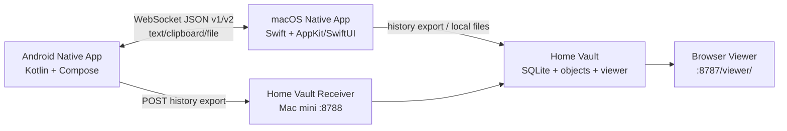

# VibeDrop 原生重构规格文档

本文档用于指导下一阶段“macOS 端 + Android 端彻底原生化重构”。当前阶段只做规格、规划和风险收敛，不开始重构实现。重构目标不是重新做一个相似工具，而是在用户可感知层面完整复刻现有 VibeDrop 的 UI、协议、数据、历史、Home Vault 和日常使用效率，然后用更原生的系统能力解决 WebView/Tauri 混合架构带来的生命周期、性能、权限和稳定性问题。

## 1. 总结论

推荐目标技术栈：

- macOS：Swift + SwiftUI + AppKit + SwiftNIO + Network.framework + GRDB(SQLite) + OSLog。
- Android：Kotlin + Jetpack Compose + Coroutines/Flow + Room(SQLite) + DataStore + OkHttp WebSocket + Foreground Service + MediaStore/SAF。
- 协议：先完整兼容现有 WebSocket JSON v1 和 HTTP/UDP discovery，不急着推翻；等双端原生稳定后，再追加 v2 envelope、ack、校验和、能力协商。
- 迁移策略：并行重写，不大爆炸替换。优先做 Android 原生端，使它能连接现有 Mac Tauri/Rust 服务；再做 macOS 原生端，使旧 Android 和新 Android 都能连接；最后做数据迁移和 Home Vault 增量同步。
- UI 策略：先像素级复刻当前 UI 和中文文案，保证肌肉记忆不变；性能优化放在数据层、连接层、渲染机制和原生系统集成里，不通过大改界面来“掩盖重构”。

为什么这样选：当前项目真正的复杂度不在按钮和页面，而在局域网连接、系统剪贴板、键盘模拟、后台保活、分享入口、文件落盘、历史归档和多设备身份识别。macOS 用 Swift/AppKit 才能更直接地处理状态栏、Accessibility、NSPasteboard、Finder/Photos 分享、窗口和系统权限；Android 用 Kotlin/Compose 才能更直接地处理前台服务、剪贴板限制、系统分享、MediaStore、网络绑定和应用生命周期。SwiftNIO 不是苹果官方框架，但它是 Swift 生态里成熟的高性能网络栈，适合承担 WebSocket server；Network.framework 更适合接口枚举、Bonjour/mDNS、连接路径监控和局域网诊断。

## 2. 重构目标

### 2.1 必须保持的用户体验目标

1. Android 首页仍然是当前 VibeDrop 的发送页：顶部品牌、设置入口、设备卡片、输入框、发送、回车、发送并回车、传图到剪贴板、传到收件箱、底部“发送/历史”导航。
2. Android 历史页仍然保留搜索、设备筛选、接收端筛选、类型筛选、时间筛选、活跃热力图、媒体预览、图片/视频打开策略、导入导出分享清空历史。
3. Android 设置页仍然保留附近电脑、连接诊断、手动 IP/端口/PIN、高级配置、媒体默认打开方式、Home Vault 同步和数据管理。
4. macOS 端仍然保留权限引导、主窗口概览、历史页、拖拽/分享发送到手机、连接设备展示、配对请求、状态栏菜单、复制地址/PIN、开机启动。
5. Home Vault 仍然能从手机直接同步历史到 Mac mini Vault，并能在浏览器里查看、搜索、筛选、按发送端/接收端/类型统计。
6. 现有历史数据必须完整保留，不能因为换原生架构导致旧记录、缩略图、文件记录、发送/接收设备信息丢失。

### 2.2 必须提升的工程目标

1. 降低 Android WebView 重渲染、bridge 注入失败、localStorage 双写和前后台生命周期带来的不确定性。
2. Android 连接服务应独立于 UI 组合树，UI 重绘不能影响 WebSocket 连接、草稿、传输状态。
3. 历史数据从“前端数组 + localStorage + JSON 文件”升级为 SQLite，一次加载数千条历史不会拖慢 UI。
4. 文件传输必须保持流式分片、背压、临时文件、完成校验和明确错误清理，不能回到整文件 base64。
5. 连接稳定性必须内建：单待确认心跳、指数退避、旧 socket 回调隔离、网络变化监听、可解释诊断日志。
6. 设备身份必须统一：发送端、接收端、历史查看器、Home Vault 都应使用同一套 canonical device identity 和 alias merge 规则。

### 2.3 非目标

1. 本轮不做 iOS、Windows、Linux 原生端。
2. 本轮不做公网账号、云同步、外网穿透、多人权限模型。
3. 本轮不把 Home Vault 做成对外互联网服务，仍按家庭局域网私人服务器设计。
4. 本轮不改品牌视觉方向，不借重构重做一套新 UI。
5. 本轮不要求马上删除 Tauri 代码，旧实现要作为兼容参考和回滚基线保留到原生端稳定。

## 3. 当前系统代码审计

### 3.1 仓库结构与主要模块

当前工程是 Tauri v2 双端工程，核心文件如下：

- `desktop/src-tauri/src/main.rs`：macOS 桌面端 Rust 主服务，约 4500 行，包含 HTTP/WebSocket server、UDP discovery、输入模拟、剪贴板轮询、配对、历史写入、文件传输、拖拽/分享、tray。
- `desktop/src/main.js`：macOS 窗口前端，约 2200 行，包含概览、历史筛选、热力图、拖拽传输状态、媒体预览、设备展示。
- `desktop/src/index.html` 与 `desktop/src/style.css`：macOS UI 结构和视觉。
- `mobile/src/app.js`：Android WebView 前端主逻辑，约 7900 行，包含发送页、历史页、设置页、连接、发现、配对、文件传输、Home Vault、媒体预览、过滤热力图。
- `mobile/src-tauri/src/lib.rs`：Android Tauri/Rust 原生命令，约 1500 行，包含历史持久化、发现、诊断、Home Vault HTTP 同步、文件落盘桥。
- `mobile/src-tauri/gen/android/app/src/main/java/com/vibedrop/mobile/*.kt`：Android 宿主层，包含前台保活、后台剪贴板 WebSocket、透明剪贴板 Activity、系统分享接入、FileProvider 等。
- `scripts/sync-home-vault.py`：Home Vault 索引和查看器生成脚本，约 2000 行，负责解析 Mac/Android/inbox 历史、SQLite、对象存储、静态 viewer。
- `scripts/home-vault-receiver.py`：Mac mini 接收服务，提供 `/api/android-history` 和 `/health`。

### 3.2 macOS 端现有能力

1. 本地服务：默认监听 `0.0.0.0:9001`，HTTP 提供 `/discover`、配对接口和静态页面，WebSocket 提供手机连接通道，UDP 9001 提供局域网发现应答。
2. 输入模拟：通过 input worker 接收 `TypeText`、`TypeTextAndEnter`、`PressEnter`，实际依赖 macOS Accessibility 权限。
3. 剪贴板轮询：通过 `arboard` 每 500ms 轮询 Mac 文本剪贴板，变化后广播给已声明 `receives_clipboard=true` 的手机后台连接。
4. 配对：手机提交配对请求，macOS UI 显示 6 位码，用户批准后手机拿到 PIN、server id、hostname、ip、port。
5. 手机到 Mac 文本：WebSocket action `type`、`type_enter`、`enter`，成功后写入历史。
6. 手机到 Mac 图片剪贴板：action `image_clipboard`，保存图片、生成 thumbnail、写入 Mac 剪贴板并记录历史。
7. 手机到 Mac 文件收件箱：既保留 legacy `file_download`，也支持 `incoming_file_start/chunk/complete` 分片接收，保存到 `~/Downloads/VibeDrop 收件箱`；多文件批次通过 `history_session_id/history_item_index/history_item_count` 聚合成一条历史。
8. Mac 到 Android 文件：拖拽/Finder 分享/Photos 选择后，按文件、目录或多选打包，使用 `incoming_file_start/chunk/complete` 发送，等待 Android `incoming_file_saved/error` ack。
9. 历史：写入 `~/.vibedrop/history.jsonl`，兼容旧 `~/.voicedrop/history.jsonl`；记录方向、类型、状态、客户端名、缩略图、文件名、session、items。
10. UI：概览、连接设备、配对、历史搜索筛选、热力图、媒体预览、拖拽传输进度、状态栏菜单。

### 3.3 Android 端现有能力

1. 发送页：按保存的桌面设备渲染卡片，支持输入文字、发送、回车、发送并回车、从剪贴板直发、传图片到 Mac 剪贴板、传文件到 Mac 收件箱。
2. 草稿保留：`sendDrafts` 内存表保存 textarea 输入，连接状态变化和设备卡片重建不清空草稿，发送成功才清空。
3. 连接：前台 WebSocket 到 Mac `/ws`，认证时上报 `device_id`、`device_name`、`can_receive_files`；心跳、pong、指数退避、旧 socket 回调隔离。
4. 后台剪贴板：Foreground Service + OkHttp WebSocket，使用 `device_role=clipboard_sync`、`base_device_id`、`receives_clipboard=true`，独立接收 Mac 剪贴板。
5. Android 剪贴板限制兜底：透明 1x1 Activity 在必要时把文本写入系统剪贴板，绕开后台写剪贴板限制。
6. 发现：UDP 广播 + HTTP `/discover` 扫描 + 已保存端点直接探测；过滤 VPN/tun 接口，支持诊断快照。
7. 配对：手机向 Mac 发起 pair request，轮询 pair status，成功后保存设备信息。
8. Mac 到 Android 文件：JS 收分片，Rust/Kotlin 原生层落盘，图片/视频进 Pictures/Movies/VibeDrop，普通文件进 Downloads 或 app 私有兜底。
9. Android 到 Mac 文件：文件选择或系统分享进入后，按块读取、WebSocket 背压、等待最终 ack，支持批量顺序发送。
10. 历史：本地内存 + localStorage + app 私有 `history.json` 双轨持久化，支持导入、导出、分享、清空、搜索、设备筛选、日期筛选、状态筛选、热力图、媒体预览。
11. Home Vault：设置页配置 `http://192.168.3.2:8788`，点击同步后读取当前历史导出格式，POST 到 Mac mini receiver，服务端保存 inbox JSON 并刷新 SQLite/viewer。

### 3.4 Home Vault 现有能力

1. Vault 根目录在 `/Volumes/SN850X/VibeDropVault`，Mac mini 接收服务监听 `:8788`，viewer 服务监听 `:8787`。
2. 同步脚本解析 Mac JSONL、Android 导出 JSON、Android inbox payload、媒体 object store，并生成 SQLite `db/vibedrop.sqlite`。
3. 对象存储使用 256 个 hash bucket，避免单目录文件过多。
4. viewer 支持搜索、类型筛选、发送端筛选、接收端筛选、候选数量预览、按数量排序、设备 alias 合并。
5. 当前策略不上传 Android 原图，只保留缩略图和历史元数据；viewer 不再提示缩略图对应原图缺失。

## 4. 核心行为规格

### 4.1 文本发送

1. 输入框非空时，发送按钮必须发送输入框内容。
2. 输入框为空时，发送按钮必须读取手机剪贴板；剪贴板非空则直接发送。
3. “发送并回车”同样遵循输入框优先、剪贴板兜底，然后触发远端回车。
4. “回车”按钮不读取剪贴板，只发送远端回车。
5. 发送成功后清空该设备草稿；发送失败不清空，方便重试。
6. 断连、连接中、认证信息更新、发现结果更新、设备排序变化，都不能清空用户正在输入的草稿。

### 4.2 剪贴板同步

1. Mac 剪贴板变化应推送到 Android 后台 clipboard connection，而不是依赖发送页前台 WebSocket。
2. Android 后台连接要使用前台服务保活，失败后指数退避，成功后重置失败计数。
3. Android 写系统剪贴板必须处理系统版本差异：前台直接写，后台必要时通过透明 Activity 兜底。
4. 不记录剪贴板正文到 debug log，避免敏感内容落盘。

### 4.3 文件与图片传输

1. 所有大文件路径使用分片协议，禁止整文件读入内存后 base64 单消息发送。
2. 分片大小保持当前量级，首版可继续使用 192 KiB，后续通过能力协商调参。
3. 发送端必须监控 WebSocket buffered amount，防止 UI 和 socket 缓冲被压爆。
4. 接收端必须先写 `.part` 临时文件，完成后校验 size，再移动到最终目录。
5. 任一侧失败都要发送 `incoming_file_error`，并清理临时文件和 pending transfer。
6. 图片进 Mac 剪贴板可以继续走单张图片 data URL，但要保留大小上限和错误提示；大图未来可单独设计“分片图片剪贴板”。
7. Mac 到 Android 的图片/视频要优先进入系统相册可见目录，普通文件进入 Downloads/VibeDrop 或 Android 下载目录。

### 4.4 发现、配对与连接

1. 保留 UDP discovery：手机广播 `{kind:"discover_probe", protocol_version:1}`，Mac 返回 desktop 信息。
2. 保留 HTTP `/discover` 兜底，用于广播不可用、路由器限制或多网卡环境。
3. 已保存设备应先直接探测已知 IP/hostname，再做完整扫描，这样常用设备恢复更快。
4. 支持多网卡候选，过滤 loopback、link-local、VPN/tun 等不适合局域网发现的接口。
5. 配对协议保留：手机 request，Mac approve/reject，手机 status 轮询拿 PIN 和 server id。
6. 连接状态不能为了“看起来绿色”而撒谎；真实不可发送时要显示连接中/断开，但草稿和历史不丢。
7. 心跳使用单待确认模型，任意服务端消息刷新 lastMessageAt，避免多个 timeout 叠加误杀可用连接。

### 4.5 历史与热力图

1. 历史记录必须区分方向、发送端、接收端、类型、状态、时间、文件名、缩略图、session、items。
2. 搜索要同时匹配正文、文件名、发送端、接收端、类型中文标签、状态中文标签。
3. 过滤顺序建议为：设备/发送端/接收端、时间、类型、状态、关键词、热力图小时。
4. 热力图颜色最大值只取当前可见窗口内的最大小时计数，不能被全量历史峰值压浅。
5. 热力图视觉首版保持白色到绿色到接近黑色的高对比阶梯，但最高值不应大片纯黑导致中高区不可读；建议使用非线性提升和 capped dark green/near-black。
6. 历史列表必须支持大量记录懒加载或虚拟化，避免一次渲染几千个复杂卡片。

### 4.6 Home Vault

1. Android 原生端必须继续生成兼容当前 Home Vault receiver 的 payload：`schemaVersion`、`app`、`deviceId`、`deviceName`、`exportedAt`、`history`。
2. 首版仍然只同步历史元数据和缩略图，不上传 Android 原图，避免体积和权限复杂度上升。
3. receiver 仍然保存到 `VibeDropVault/inbox/android/<device>/...json`，然后调用同步脚本刷新 DB/viewer。
4. viewer 的发送端/接收端候选要显示数量，按数量排序，并应用 canonical alias merge。
5. 同步按钮要显示成功上传条数、Vault 当前总数、失败原因；失败原因应翻译为用户能理解的网络/权限/服务问题。

## 5. 新架构设计

### 5.1 总体拓扑



核心原则：设备间实时操作继续点对点局域网直连；Home Vault 是归档和查看，不参与实时发送路径；Android UI 和 macOS UI 都只调用本地 service/repository，不直接把网络逻辑塞进按钮事件。

### 5.2 macOS 原生端分层

建议模块：

1. `AppShell`：SwiftUI app lifecycle、窗口创建、设置窗口、权限引导入口。
2. `StatusBarController`：AppKit `NSStatusItem`、菜单、复制地址/PIN、打开窗口、退出。
3. `AccessibilityService`：检测和引导 Accessibility 权限，封装 `CGEvent` 或 AX 输入模拟。
4. `ClipboardService`：`NSPasteboard` 监听/轮询、去重、广播变更。
5. `NetworkServer`：SwiftNIO HTTP/WebSocket server，处理 `/ws`、`/discover`、pair routes、静态资源必要入口。
6. `DiscoveryService`：UDP responder、Bonjour/mDNS 可选公告、Network.framework path/interface 诊断。
7. `DeviceRegistry`：连接客户端、primary/background connection 合并、能力上报、preferred share target。
8. `TransferService`：双向分片传输、临时文件、校验、ack、进度事件。
9. `HistoryStore`：GRDB/SQLite，写入和查询历史、生成 heatmap 聚合。
10. `FileShareService`：拖拽、Finder share、Photos promise、目录打包、缩略图生成。
11. `HomeVaultSyncClient`：可选地把本机历史同步到 Home Vault，首版也可继续由脚本拉取。

### 5.3 Android 原生端分层

建议模块：

1. `MainActivity`：Compose host、权限入口、系统 share intent 接收。
2. `VibeDropAppState`：全局导航、toast、dialog、当前页面状态。
3. `DeviceRepository`：保存桌面设备、canonical identity、server id、hostname、ip、port、PIN、aliases。
4. `ConnectionManager`：每台 Mac 的前台发送 WebSocket 状态，Flow 输出 connected/connecting/error。
5. `ClipboardSyncService`：Foreground Service，独立 OkHttp WebSocket，接收 Mac 剪贴板。
6. `DiscoveryRepository`：UDP/HTTP discovery、pair request/status、诊断 snapshot。
7. `TransferRepository`：Android 到 Mac 文件发送、Mac 到 Android 文件接收、系统 share cache、MediaStore 落盘。
8. `HistoryRepository`：Room 数据库、导入导出、查询、搜索、heatmap 聚合。
9. `SettingsRepository`：DataStore 保存 Home Vault URL、默认媒体 opener、连接偏好。
10. `HomeVaultClient`：OkHttp POST `/api/android-history`，支持 Wi-Fi 网络选择和失败解释。
11. `UiScreens`：Send、History、Settings、MediaPreview、Pairing、Diagnostics，全部 Compose。

### 5.4 为什么不继续扩大 Tauri/Rust

Tauri 的优势是跨端复用 UI 和一部分 Rust 逻辑，但这个项目已经深度依赖两端完全不同的系统能力：macOS 要 Accessibility、NSPasteboard、NSStatusItem、Finder/Photos；Android 要 Foreground Service、ClipboardManager 限制、MediaStore、Intent share、WebView bridge。继续在 WebView 前端里堆状态，会让 UI 重绘、bridge 注入、应用前后台、权限回调和网络连接互相影响。原生重构不是为了“语言更高级”，而是为了让系统生命周期由系统原生框架接管，把实时连接、文件传输、历史数据库从 WebView 里拆出来。

### 5.5 为什么不选 Flutter / Compose Multiplatform / React Native

Flutter 和 React Native 都能做漂亮 UI，但它们仍然会在系统剪贴板、后台服务、状态栏菜单、Accessibility、Finder 分享等位置写大量平台插件；最后复杂度仍在桥接层。Compose Multiplatform 对 Android 很自然，但 macOS 端的状态栏、菜单、Accessibility、NSPasteboard、窗口行为仍不如 Swift/AppKit 直接。当前用户只用 Android + macOS，不需要牺牲原生性换跨端 UI 复用。

## 6. 协议规格

### 6.1 v1 兼容协议必须保留

现有 action 首版都要继续支持：

- `auth`
- `ping`
- `pong`
- `clipboard`
- `type`
- `type_enter`
- `enter`
- `image_clipboard`
- `file_download`
- `incoming_history_session_start`
- `incoming_file_start`
- `incoming_file_chunk`
- `incoming_file_complete`
- `incoming_file_saved`
- `incoming_file_error`

现有 discovery/pair endpoints 首版也要继续支持：

- `GET /discover`
- `POST /pair/request`
- `GET /pair/status/{request_id}`
- UDP `discover_probe`

兼容性要求：

1. 新 Android 必须能连接旧 Mac。
2. 旧 Android 必须能连接新 Mac。
3. 新 Android 与新 Mac 使用 v1 时行为完全一致。
4. v2 只能通过能力协商启用，不能破坏旧端。

### 6.2 v2 envelope 建议

等 v1 parity 完成后，可以引入统一 envelope：

```json
{
  "protocolVersion": 2,
  "messageId": "msg_...",
  "action": "incoming_file_start",
  "sentAt": "2026-05-28T12:00:00.000Z",
  "sender": {
    "deviceId": "client_xxx",
    "baseDeviceId": "client_xxx",
    "name": "一加 Ace 5",
    "role": "primary"
  },
  "receiver": {
    "deviceId": "desktop_xxx",
    "name": "overlorddeMacBook-Air-4.local"
  },
  "capabilities": ["chunked_file_v1", "clipboard_text_v1"],
  "payload": {}
}
```

v2 的价值是让发送端/接收端、message id、重试、ack、能力协商都有统一位置。当前 Home Vault 里“未知发送端”和设备 alias 合并问题，本质就是历史记录缺少稳定的双端身份字段；v2 应把这件事前置到协议层。

### 6.3 设备身份规则

每台设备需要区分三类 ID：

1. `installationId`：App 安装实例 ID，重装会变。
2. `hardwareLabel`：用户可读设备名，如“一加 Ace 5”“overlorddeMacBook-Air-4.local”，可能变化。
3. `stableServerId/baseDeviceId`：用于合并同一设备多个连接或多条历史的稳定 ID。

历史记录必须同时保存：

- sender id/name/role
- receiver id/name/role
- connection id/session id
- raw aliases

展示时再做 canonical merge，而不是在写入时丢掉原始信息。这样以后看到“一加 Ace 5”“未知发送端”“android-inbox:client_xxx”时，可以在 viewer 和 app 内统一归并，同时仍可追溯原始来源。

## 7. 数据模型与迁移

### 7.1 新 SQLite 模型

建议 macOS 和 Android 都使用 SQLite，表结构保持概念一致，但不强求完全同 schema。

核心表：

```text
devices
  id
  stable_id
  display_name
  role
  host
  ip
  port
  aliases_json
  capabilities_json
  last_seen_at
  created_at
  updated_at

history_entries
  id
  timestamp
  direction
  kind
  status
  text
  sender_device_id
  sender_name
  receiver_device_id
  receiver_name
  session_id
  item_count
  save_target
  raw_json
  created_at

history_items
  id
  entry_id
  item_index
  kind
  file_name
  mime_type
  size_bytes
  local_path
  saved_path
  thumbnail_path
  thumbnail_data_url
  status
  error

transfer_sessions
  id
  direction
  peer_device_id
  status
  bytes_total
  bytes_sent
  bytes_received
  started_at
  finished_at
  error

settings
  key
  value_json
  updated_at
```

索引：

- `history_entries(timestamp desc)`
- `history_entries(sender_device_id, timestamp desc)`
- `history_entries(receiver_device_id, timestamp desc)`
- `history_entries(kind, timestamp desc)`
- `history_entries(status, timestamp desc)`
- `history_items(entry_id)`
- `devices(stable_id)`

### 7.2 Android 迁移

当前 Android 数据来源：

- app 私有 `history.json`
- 旧 localStorage key `voicedrop_history`
- 设置 key `voicedrop_settings`
- client identity key `vibedrop_client_identity`
- 系统下载目录里用户导出的 `vibedrop_history_*.json`

原生 Android 如果保持同一个 `applicationId=com.vibedrop.mobile`，并使用同一签名升级安装，就能保留 app 私有目录。迁移器首次启动时应读取旧 `history.json`，导入 Room，记录 migration marker；localStorage 不能再直接依赖，因为 WebView 存储路径属于旧实现细节，必须把 `history.json` 视作主要迁移源。若用户从全新安装开始，可通过导入历史 JSON 恢复。

### 7.3 macOS 迁移

当前 macOS 数据来源：

- `~/.vibedrop/history.jsonl`
- `~/.voicedrop/history.jsonl`
- `~/.vibedrop/received-images`
- `~/Downloads/VibeDrop 收件箱`
- `~/.vibedrop/server-id`
- `~/.vibedrop/pin`
- Tauri window state 和前端缓存

原生 macOS 首版应继续读取 `~/.vibedrop`，不要立即搬到新的 Application Support 后删除旧文件。建议新库位于 `~/Library/Application Support/VibeDrop/vibedrop.sqlite`，首次启动导入 JSONL，保留原文件作为审计和回滚来源。PIN/server-id 可以继续沿用旧路径，等稳定后再迁移到 Application Support，并留下兼容读取。

### 7.4 Home Vault 迁移

Home Vault 已经有 SQLite 和 object store，短期不需要推翻。原生端只需要继续生成兼容 payload。中期可以增加 delta sync：

1. App 保存最近成功同步的 `lastSyncedEntryId/timestamp`。
2. 每次只上传新增和变更历史。
3. receiver 仍按 entry stable id 去重，允许重复上传。
4. 定期可做 full snapshot 校验，避免长时间增量漏数据。

这样不会每小时创建大量重复文件，也不会依赖单次全量备份。专业系统常见做法是“增量日志 + 可去重对象存储 + 定期快照”，不是每小时完整复制一份目录。

## 8. UI 复刻规格

### 8.1 Android 发送页

必须复刻：

1. 顶部状态栏下方的 VibeDrop 品牌、图标、设置按钮。
2. 设备卡片：连接圆点、设备名、状态文字、输入框、按钮布局。
3. 已连接绿色、连接中黄色/灰态、断开灰态、按钮 disabled 视觉。
4. “发送”“回车”“发送并回车”“传图到剪贴板”“传到收件箱”中文文案。
5. 底部浮动导航“发送 / 历史”。
6. 输入框高度稳定，连接状态变化不能导致布局抖动。
7. 键盘弹出时仍能正常输入和点击主要按钮。

Compose 实现建议：`Scaffold` + 自定义 header + `LazyColumn` 设备卡片 + bottom bar；卡片、按钮、输入框用自定义 style 复刻现有 CSS 尺寸和圆角。不要直接使用默认 Material 外观，否则会和当前 UI 气质明显不一致。

### 8.2 Android 历史页

必须复刻：

1. 搜索框和清空按钮。
2. 快速时间筛选：全部时间、今天、近 7 天、近 30 天、自定义。
3. 活跃热力图：5 天可见窗口、左右滑动、小时点击筛选、统计卡片。
4. 历史卡片：时间、文本/文件/图片/视频类型、状态、目标设备、缩略图、媒体预览。
5. 媒体 opener 设置逻辑：系统默认、相册、浏览器或每次询问。

Compose 实现建议：历史列表用 `LazyColumn`，热力图用 Canvas 或固定网格 Composable；热力图统计从 Room query 或内存聚合生成，窗口切换只重算可见天。

### 8.3 Android 设置页

必须复刻：

1. 附近电脑扫描、保存、配对。
2. 连接诊断：显示原生能力、网络接口、已保存设备、最近错误。
3. 手动 IP/端口/PIN。
4. 数据管理：Home Vault URL、同步到 Mac mini、导入历史、导出历史、分享历史、清空历史。
5. 媒体打开策略：图片和视频分别设置。

设置页是问题排查入口，原生重构时要比现在更强：每个网络失败要尽量给出用户能理解的原因，比如服务没启动、端口不通、被 VPN 绑定失败、权限缺失、HTTP 502。

### 8.4 macOS 端 UI

必须复刻：

1. Accessibility 权限引导页。
2. 主窗口概览：主机名、IP、端口、PIN、连接状态、连接设备、配对请求。
3. 拖拽发送区：目标手机选择、拖拽文件/目录、传输进度、错误提示。
4. 历史页：搜索、设备/时间/类型/状态筛选、热力图、历史列表、媒体预览。
5. 状态栏菜单：地址、PIN、复制地址、复制 PIN、打开 VibeDrop、退出。

SwiftUI 可承担主要页面，但状态栏、菜单、窗口细节、拖拽文件 promise、分享扩展、NSPasteboard 等必须由 AppKit bridge 处理。

## 9. 性能与稳定性规格

### 9.1 Android 性能

1. App 冷启动后不应一次性把所有历史卡片渲染进 UI；Room 分页或按时间窗口查询。
2. 发送页连接状态用 Flow 更新，不重建整个页面导致输入框丢焦点。
3. 大文件发送读取必须在 IO dispatcher，UI 只观察进度。
4. 图片缩略图缓存应有尺寸上限，不把原图塞进数据库。
5. Home Vault 上传可以在前台按钮触发，也可后续接 WorkManager 定时增量；首版不要后台自动偷跑大流量。

### 9.2 macOS 性能

1. WebSocket server 和文件传输不能阻塞主线程。
2. 剪贴板监听应去重，避免频繁广播同一内容。
3. 历史查询和 heatmap 聚合使用 SQLite 索引，不在 UI 层全量扫描大数组。
4. 缩略图生成放后台队列，失败时记录 no-preview，不阻塞传输本身。
5. 状态栏菜单和窗口 UI 只观察状态，不直接持有 socket。

### 9.3 稳定性

1. 每条连接有明确状态机：idle、connecting、authenticating、connected、reconnecting、failed、disabled。
2. reconnect 使用指数退避和抖动，持续失败不高频刷网络。
3. 新连接替换旧连接后，旧连接迟到回调不能修改当前状态。
4. 网络变化事件触发快速探测，但不能清空用户草稿或历史。
5. 所有重要生命周期写结构化日志：connect open/auth/close/error、discovery、pair、transfer start/progress/finish/error、Home Vault sync。

## 10. 安全、权限与隐私

### 10.1 权限

macOS：

- Accessibility：键盘输入模拟必需。
- Local Network/Firewall：监听局域网端口，必要时引导用户允许。
- Files/Finder/Photos：拖拽和分享时只访问用户显式选择的文件。

Android：

- INTERNET、ACCESS_NETWORK_STATE。
- Foreground Service 和 Android 13+ notification。
- MediaStore 写入图片/视频。
- 读取系统分享 URI 的一次性授权。
- 剪贴板读取只在用户点击发送按钮时触发，避免不必要隐私提示。

### 10.2 隐私边界

1. debug log 不写正文、剪贴板内容和完整文件内容。
2. 历史数据库会保存用户主动发送/接收的文本，这是产品核心能力，清空历史必须能删除本地记录。
3. Home Vault 默认只在家庭局域网使用，首版 receiver 可继续无 token，但文档和 UI 应提示只在可信局域网运行；后续建议加 token。
4. PIN 仍用于局域网配对和连接认证，不应明文展示在非必要 UI 上过久；复制 PIN 是用户主动动作。

## 11. 实施路线

### 阶段 0：冻结现有行为与测试样本

产物：

- 收集当前 Android 和 macOS 主要页面截图，作为 UI 复刻基准。
- 导出现有 Mac JSONL、Android history.json、Home Vault viewer JSON，作为迁移 fixture。
- 写协议兼容清单，列出每个 action 的请求/响应样例。
- 记录当前 APK 包名、签名策略、macOS bundle id，确保后续能覆盖安装并保留数据。

验收：

- 能用 fixture 复现至少：文本、发送并回车、图片剪贴板、手机到 Mac 文件、Mac 到手机文件、批量、失败记录、Home Vault 同步。

### 阶段 1：协议与数据层先行

产物：

- 建立 shared protocol spec 文档和 JSON fixture。
- Android Room schema 和迁移器。
- macOS GRDB schema 和 JSONL 导入器。
- Home Vault payload generator 保持兼容。

验收：

- 不启动 UI，也能把旧历史导入新 SQLite。
- 导入前后记录数、关键字段、设备名、缩略图引用可对账。

### 阶段 2：Android 原生端先连接旧 Mac

原因：当前不稳定和效率问题主要集中在 Android WebView 生命周期、剪贴板、连接、草稿和本地历史。先让原生 Android 连接现有 Mac，可以缩小变量。

产物：

- Compose 发送页、历史页、设置页 UI 复刻。
- OkHttp 前台连接，支持 auth/type/type_enter/enter/ping。
- 从剪贴板直发、草稿保留、连接状态。
- Room 历史读写和基础筛选。

验收：

- 新 Android 可连接旧 Mac Tauri/Rust 端。
- 用户日常最高频“复制手机内容 -> 点发送并回车 -> Mac 输入”完整可用。
- 断连/重连不丢草稿。

### 阶段 3：Android 文件、后台剪贴板、Home Vault

产物：

- Android 到 Mac 图片剪贴板和文件收件箱。
- Mac 到 Android 分片接收、MediaStore 落盘。
- Foreground Service 后台剪贴板接收。
- Home Vault 直接同步。
- 导入/导出/分享/清空历史。

验收：

- 文件传输通过大文件、批量、系统分享、失败清理测试。
- 后台剪贴板在锁屏/切后台场景保持可解释状态。
- Home Vault viewer 总数、发送端/接收端筛选、缩略图正常。

### 阶段 4：macOS 原生端连接新旧 Android

产物：

- SwiftUI/AppKit 主窗口、tray、权限引导。
- SwiftNIO HTTP/WebSocket server，兼容 v1。
- UDP discovery、pair、device registry。
- 输入模拟、剪贴板广播、历史写入。
- 手机到 Mac 文本/图片/文件。

验收：

- 旧 Tauri Android 和新 Kotlin Android 都能连接新 macOS。
- Mac 状态栏、权限、输入模拟、剪贴板广播行为一致。
- `~/.vibedrop/history.jsonl` 旧数据可导入，新数据以 SQLite 为主存储，同时向 `~/.vibedrop/history.jsonl` 追加兼容 JSONL，保证现有 Home Vault/脚本链路继续可读。

### 阶段 5：macOS 拖拽/分享与历史页面

产物：

- 拖拽文件/目录发送到 Android。
- Finder/Photos 分享入口。
- 缩略图生成、zip 打包、传输进度。
- macOS 历史页完整筛选和热力图。

验收：

- 单文件、目录、多图、多视频、Photos promise 文件都能发送。
- 历史页在大数据量下滚动顺畅。

### 阶段 6：切换、回滚与清理

产物：

- 明确安装包升级路径。
- 一键导出诊断包，不含敏感正文。
- 保留旧 Tauri 分支和 release tag。
- 原生端稳定后再决定删除或归档 Tauri 代码。

验收：

- 用户可从当前版本升级到原生版本，历史仍在。
- 如果原生版本出问题，仍能安装旧版本或通过导出历史恢复。

## 12. 测试计划

### 12.1 协议兼容测试

1. 新 Android -> 旧 Mac：text、type_enter、enter、image_clipboard、chunked file。
2. 旧 Android -> 新 Mac：text、type_enter、enter、image_clipboard、chunked file。
3. 新 Mac -> 新 Android：desktop to mobile file、batch、history session、ack/error。
4. ping/pong、auth failed、PIN 错误、旧 socket 关闭、reconnect。

### 12.2 数据迁移测试

1. Mac JSONL 导入后记录数一致。
2. Android history.json 导入后记录数一致。
3. 重复导入不产生重复记录。
4. 缩略图、文件名、状态、方向、发送端、接收端可对账。
5. Home Vault 同步后 DB 总数与 viewer 显示一致。

### 12.3 UI 复刻测试

1. Android 发送页 393x852、430x932 等常见屏幕截图对比。
2. Android 历史页长列表、热力图、设置页截图对比。
3. macOS 默认窗口、小窗口、历史页、权限页截图对比。
4. 文本不溢出按钮，输入框不因状态变化跳动，底部导航不遮挡主要操作。

### 12.4 稳定性测试

1. 同 Wi-Fi 空闲 1 小时，绿灯不应无故频繁变灰。
2. 临时关闭 Mac 服务再恢复，Android 自动重连，草稿保留。
3. 打开/关闭 VPN，诊断能解释当前使用网络和失败原因。
4. Android 锁屏、切后台、回前台，后台剪贴板服务状态正确。
5. Mac 睡眠唤醒后服务恢复监听，手机可重连。

### 12.5 文件传输测试

1. 1KB、5MB、50MB、500MB 文件。
2. 图片到剪贴板、视频到收件箱、目录 zip、多文件批量。
3. 中途断网、磁盘空间不足、权限失败、目标手机拒收。
4. Android 系统分享单文件、多文件、content URI、无文件名 URI。

## 13. 风险与应对

### 13.1 重构范围过大

风险：双端同时原生化容易拖长周期，甚至长期没有可用版本。应对：先做 Android 原生连接旧 Mac，再做 macOS 原生；每阶段都必须能独立交付可用价值。

### 13.2 UI 复刻低估

风险：Compose/SwiftUI 默认控件和当前 Web/CSS 视觉差异大。应对：建立截图基准，自定义按钮、卡片、输入框样式；先复刻视觉再谈设计升级。

### 13.3 数据迁移丢失

风险：Android localStorage 和 app 私有文件来源复杂，Mac JSONL 历史字段不统一。应对：只追加导入，不删除旧文件；所有迁移可重复执行并去重；导入结果要能输出对账报告。

### 13.4 系统权限变化

风险：Android 剪贴板和后台服务限制、macOS Accessibility/Local Network 行为会随系统版本变化。应对：权限逻辑集中封装，诊断页展示权限状态和最近失败，不把权限失败伪装成普通断联。

### 13.5 协议漂移

风险：原生端写新协议后旧端不可用。应对：v1 fixture 作为兼容测试，v2 只能能力协商启用；旧 action 直到切换完成前不能删。

## 14. 后续可选优化

1. Home Vault 增量同步和定时同步：用 WorkManager 每小时同步新增记录，不做全量重复备份。
2. Bonjour/mDNS 服务公告：减少扫网段，提升发现速度。
3. 文件传输校验和与断点续传：适合大视频和不稳定 Wi-Fi。
4. Home Vault token：家庭局域网内也可以防误上传。
5. 历史全文索引：SQLite FTS5 支持更快搜索和中文分词优化。
6. 设备别名管理 UI：允许用户把多个历史别名手动合并成一个设备。
7. 连接质量面板：显示延迟、最近 pong、重连次数、当前网络接口、目标 IP。

## 15. 第一轮执行建议

下一步不应直接新建两个空 App 然后边写边想，而应先做三件小而确定的事：

1. 建 `docs/protocol-v1-fixtures/`，把当前真实 WebSocket 消息和 history 样本固化。
2. 建 `native/android/` 原生 Kotlin/Compose 空壳，先实现 Room 迁移旧 `history.json` 和发送页静态复刻。
3. 保持当前 Tauri Mac 不动，让新 Android 第一个里程碑只连接旧 Mac 完成文本发送。

这样做的工程意义是：先把最高频路径跑通，同时不破坏现在可用的版本；一旦 Android 原生端证明可靠，再逐步替换 macOS 端。原生重构最怕“一次性推翻所有东西”，这个项目的正确打法是协议兼容、数据先行、UI 复刻、逐段切换。
